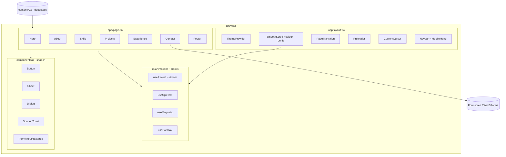
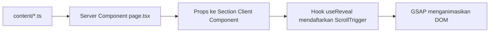
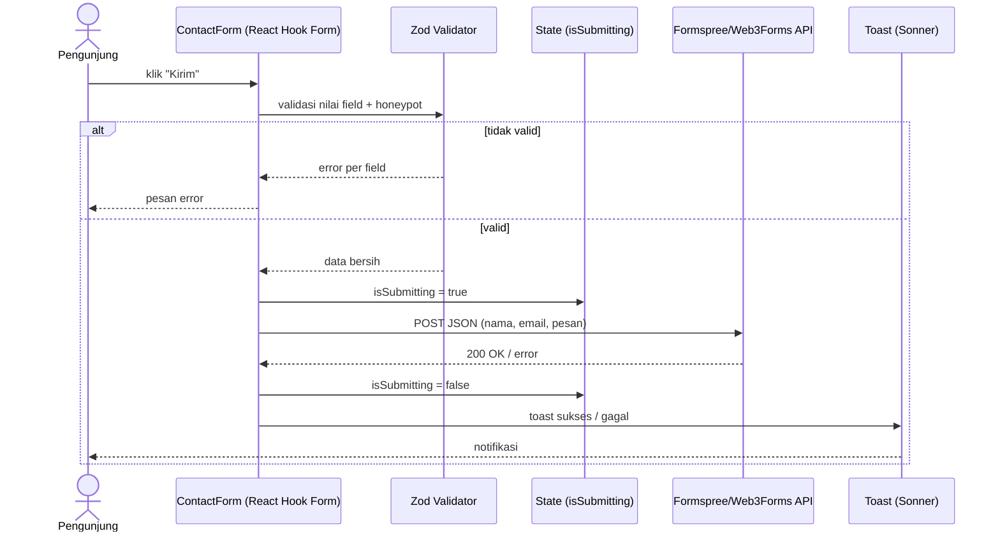
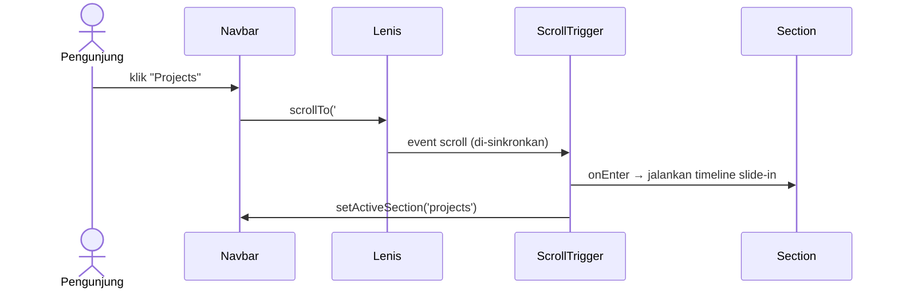

# design.md — Desain Teknis Portofolio

## 1. Keputusan Teknologi

**Bahasa utama: TypeScript** (di atas JavaScript), plus HTML & CSS (via Tailwind).
Alasannya: type-safety untuk data konten & props komponen, autocomplete lebih baik untuk GSAP/React, dan didukung penuh oleh Next.js dan shadcn/ui.

| Lapisan | Pilihan | Alasan |
|---|---|---|
| Framework | **Next.js (App Router) + React** | Routing, SEO, optimasi gambar/font, deploy 1-klik di Vercel |
| Bahasa | **TypeScript** | Aman & mudah di-maintain |
| Styling | **Tailwind CSS** | Responsive cepat, design token via CSS variables |
| Komponen UI | **shadcn/ui** (Radix) | Sheet (menu mobile), Dialog, Toast (Sonner), Form, Button, Badge |
| Animasi utama | **GSAP + ScrollTrigger + SplitText** (`@gsap/react`) | Slide-in per section, split text, parallax, pin, timeline |
| Animasi mikro | **anime.js** (v4) | SVG path draw, counter, motion graphic ringan |
| Smooth scroll | **Lenis** | Scroll halus, terintegrasi dengan ScrollTrigger |
| Transisi halaman | **GSAP timeline** (overlay wipe) atau Framer Motion `AnimatePresence` | Pilih satu (rekomendasi: GSAP agar konsisten) |
| Ikon | **lucide-react** | Bawaan shadcn |
| Font | **next/font** (mis. satu display + satu sans) | Tanpa layout shift |
| Form | **React Hook Form + Zod** | Validasi |
| Pengiriman form | **Formspree / Web3Forms** | Tanpa backend sendiri; cocok untuk hosting statis |
| Tema | **next-themes** | Dark/light |
| Kualitas desain | **taste-skill** | Lihat bagian 8 |
| Hosting | **Vercel** (utama), alternatif Netlify / GitHub Pages | Lihat bagian 7 |

> Catatan: pakai **satu** library animasi sebagai "mesin utama" (GSAP). anime.js hanya untuk kasus spesifik agar bundle tidak membengkak dan tidak saling bentrok pada elemen yang sama.

## 2. Arsitektur

### 2.1 Diagram Komponen



### 2.2 Struktur Folder

```
portfolio/
├─ app/
│  ├─ layout.tsx            # provider global, font, metadata
│  ├─ page.tsx              # merangkai semua section
│  ├─ projects/[slug]/page.tsx
│  ├─ sitemap.ts · robots.ts
│  └─ globals.css           # design token, skala tipografi
├─ components/
│  ├─ sections/             # Hero, About, Skills, Projects, Experience, Contact, Footer
│  ├─ layout/               # Navbar, MobileMenu, Preloader, PageTransition, CustomCursor
│  ├─ motion/               # Reveal, SplitText, Marquee, MagneticButton, TiltCard
│  └─ ui/                   # hasil shadcn
├─ hooks/                   # useReveal, useActiveSection, useMagnetic, useReducedMotion
├─ lib/
│  ├─ gsap.ts               # register plugin satu kali
│  ├─ utils.ts · validators.ts (zod)
├─ content/                 # projects.ts, skills.ts, experience.ts, profile.ts
├─ public/                  # cv.pdf, og-image, gambar
├─ .agents/ atau skills/    # hasil install taste-skill
└─ next.config.ts           # output: 'export' bila ke GitHub Pages
```

## 3. Sistem Desain

### 3.1 Tipografi (fluid, konsisten antar section)

| Token | Nilai | Pemakaian |
|---|---|---|
| `--fs-display` | `clamp(3rem, 8vw + 1rem, 8rem)` | Headline Hero |
| `--fs-h2` | `clamp(2rem, 4vw + 1rem, 4rem)` | Judul section |
| `--fs-h3` | `clamp(1.25rem, 1.5vw + 1rem, 1.75rem)` | Judul kartu |
| `--fs-body` | `clamp(1rem, 0.3vw + 0.95rem, 1.125rem)` | Paragraf (line-height 1.6, max 65ch) |
| `--fs-label` | `0.8125rem` + letter-spacing 0.08em, uppercase | Label/eyebrow section |

Aturan penempatan: setiap section memakai pola sama — **eyebrow label → judul H2 → konten**; padding vertikal `clamp(5rem, 12vw, 10rem)`; container max-width 1280px dengan grid 12 kolom.

### 3.2 Pola Animasi per Section

| Section | Arah slide-in | Efek tambahan |
|---|---|---|
| Hero | Naik dari bawah (per kata) | Split text, rolling role, parallax latar |
| About | Dari kiri (teks), dari kanan (foto) | Foto reveal dengan clip-path |
| Skills | Dari bawah + stagger | Motion graphic SVG, counter, marquee ikon |
| Projects | Dari kanan | Tilt + hover preview, filter dengan layout transition |
| Experience | Dari kiri | Garis timeline "tergambar" mengikuti scroll |
| Contact | Dari bawah | Input focus animation, tombol magnetic |

### 3.3 Aturan Gerak

- Durasi 0.6–1 dtk, easing `power3.out` (masuk) / `power2.inOut` (transisi).
- Animasikan hanya `transform` & `opacity`; `will-change` dipasang sementara.
- Trigger: `start: "top 80%"`, `once: true`.
- Semua animasi dibungkus `gsap.matchMedia()` agar patuh `prefers-reduced-motion` dan bisa dibedakan desktop vs mobile.

## 4. Diagram Alur Data

### 4.1 Alur render konten (build time)



### 4.2 Jika pengguna klik "Kirim" — data lari ke mana dulu sebelum disimpan?



Urutan singkat: **Form → Validasi (Zod) → State loading → API layanan form (tempat data disimpan & diteruskan ke email Anda) → Toast ke pengguna.** Situs tidak punya database sendiri.

### 4.3 Alur klik navigasi



## 5. Integrasi Library (Poin Penting)

1. **Satu registrasi GSAP** di `lib/gsap.ts` (`gsap.registerPlugin(ScrollTrigger, SplitText)`).
2. **Lenis ↔ ScrollTrigger**: panggil `lenis.on('scroll', ScrollTrigger.update)` dan jalankan `lenis.raf` lewat `gsap.ticker`.
3. **React**: pakai `useGSAP()` dengan `scope` dan cleanup otomatis; hindari animasi di luar hook (mencegah memory leak/duplikasi di React Strict Mode).
4. **shadcn/ui**: dipakai untuk komponen fungsional; animasi tambahan dibungkus di komponen `motion/`, bukan mengubah file `ui/`.
5. **anime.js**: dipakai pada komponen terisolasi (mis. SVG skills) dengan `useEffect` + cleanup.
6. **Hindari bentrok**: satu elemen = satu library animasi.

## 6. Responsive Strategy

- Mobile-first; breakpoint Tailwind `sm 640 / md 768 / lg 1024 / xl 1280`.
- Grid: 1 kolom (mobile) → 2 kolom (md) → 12 kolom (lg+).
- Mobile: custom cursor dimatikan, parallax dikurangi, jarak slide-in diperpendek, menu via `Sheet`.
- Gambar: `next/image` dengan `sizes` dan format WebP/AVIF.

## 7. Deployment

| Opsi | Cara | Catatan |
|---|---|---|
| **Vercel (rekomendasi)** | Push repo GitHub → Import di vercel.com → deploy otomatis tiap push | Fitur Next.js penuh, preview URL per PR |
| Netlify | Hubungkan repo; build `npm run build`, plugin Next.js otomatis | Alternatif setara |
| GitHub Pages | `output: 'export'`, `images.unoptimized: true`, `basePath` sesuai nama repo, deploy via GitHub Actions | Hanya statis; tidak ada fitur server |

Environment variable: `NEXT_PUBLIC_FORM_ENDPOINT`. Domain kustom opsional (DNS CNAME ke penyedia hosting).

## 8. Pemakaian taste-skill

taste-skill adalah **agent skill** untuk AI coding tool (Cursor, Claude Code, Codex, dll.), bukan library runtime. Ia memberi aturan anti-"AI slop" untuk layout, tipografi, spacing, dan motion.

- Instal: `npx skills add https://github.com/Leonxlnx/taste-skill --skill "design-taste-frontend"`
- Ada juga varian `design-taste-frontend-v1`, `minimalist-skill`, `soft-skill`, `brutalist-skill`, dan `redesign-skill` (cocok karena Anda sedang me-redesign portofolio lama).
- Cara pakai: instal skill sebelum meminta AI menulis komponen section, lalu minta AI mengikuti skill tersebut saat membuat UI.
- Periksa README repo untuk nama skill terbaru karena proyek ini aktif berubah.

## 9. Risiko & Mitigasi

| Risiko | Mitigasi |
|---|---|
| Animasi berat di HP kelas bawah | Kurangi parallax/marquee di mobile, `matchMedia`, uji FPS |
| Konflik Lenis + ScrollTrigger | Sinkronkan lewat ticker (bagian 5) |
| Duplikasi animasi di React Strict Mode | `useGSAP` + cleanup |
| Skor Lighthouse turun karena font/gambar | `next/font`, `next/image`, lazy-load, batasi bundle animasi |
| Form dibanjiri spam | Honeypot + captcha bawaan Formspree/Web3Forms |
| Konten tersembunyi jika JS gagal | Jangan set `opacity:0` di CSS global; set dari JS saat inisialisasi |
