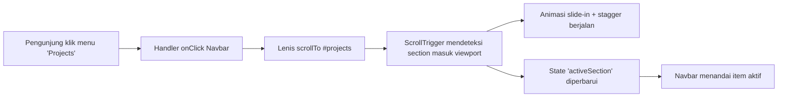
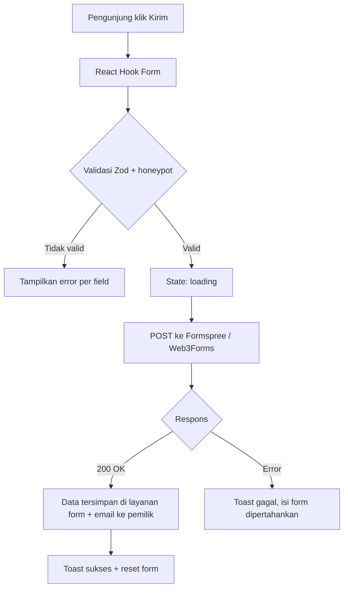

# requirement.md — Redesign Web Portofolio

Format kebutuhan: **SAAT [kejadian] … MAKA SISTEM HARUS [perilaku].**

## 1. Tujuan

Membuat ulang web portofolio yang responsive, kaya animasi (hover, transisi halaman, motion graphic, teks bergerak, slide-in per section), tipografi konsisten antar section, dan live di Vercel / Netlify / GitHub Pages.

## 2. Aktor

| Aktor | Deskripsi |
|---|---|
| Pengunjung | Recruiter, klien, sesama developer yang membuka portofolio |
| Pemilik | Anda, mengelola konten lewat file data (`/content`) dan melakukan deploy |

## 3. Kebutuhan Fungsional (EARS)

### 3.1 Struktur & Navigasi

| ID | Kebutuhan |
|---|---|
| FR-01 | SAAT pengunjung membuka URL utama, MAKA SISTEM HARUS menampilkan Hero, About, Skills, Projects, Experience, Contact, dan Footer secara berurutan dalam satu halaman. |
| FR-02 | SAAT pengunjung mengklik item navbar, MAKA SISTEM HARUS men-scroll halus (smooth scroll) ke section tujuan. |
| FR-03 | SAAT pengunjung men-scroll halaman, MAKA SISTEM HARUS menandai item navbar dari section yang sedang terlihat sebagai aktif. |
| FR-04 | SAAT pengunjung men-scroll ke bawah melewati Hero, MAKA SISTEM HARUS menampilkan navbar dalam bentuk compact (blur background) dan SAAT scroll ke atas MAKA SISTEM HARUS menampilkannya kembali. |
| FR-05 | SAAT layar berukuran < 768px, MAKA SISTEM HARUS menampilkan menu hamburger yang membuka menu fullscreen dengan animasi. |

### 3.2 Animasi

| ID | Kebutuhan |
|---|---|
| AN-01 | SAAT sebuah section memasuki viewport (≥ 20% terlihat), MAKA SISTEM HARUS menjalankan animasi slide-in (dari kiri/kanan/bawah, bergantian per section) untuk judul dan kontennya, satu kali saja. |
| AN-02 | SAAT elemen anak dalam satu section muncul, MAKA SISTEM HARUS menampilkannya dengan efek stagger (jeda 60–120 ms antar elemen). |
| AN-03 | SAAT halaman pertama kali dimuat, MAKA SISTEM HARUS menjalankan intro (preloader singkat ≤ 2 detik) lalu animasi masuk Hero. |
| AN-04 | SAAT Hero tampil, MAKA SISTEM HARUS menganimasikan headline per huruf/kata (split text reveal) dan memutar teks peran (mis. "Frontend Developer", "UI Engineer") secara bergantian (typewriter / rolling text). |
| AN-05 | SAAT pengunjung men-scroll, MAKA SISTEM HARUS menjalankan marquee teks (running text) dan elemen parallax ringan pada latar. |
| AN-06 | SAAT kursor berada di atas tombol, kartu proyek, atau link, MAKA SISTEM HARUS menjalankan hover effect (magnetic button, scale/tilt kartu, underline animasi, preview gambar). |
| AN-07 | SAAT pengunjung memakai perangkat desktop dengan mouse, MAKA SISTEM HARUS menampilkan custom cursor yang berubah bentuk saat berada di atas elemen interaktif. |
| AN-08 | SAAT pengunjung berpindah halaman (mis. dari beranda ke detail proyek), MAKA SISTEM HARUS menjalankan transisi halaman (wipe/fade) tanpa kedip layar putih. |
| AN-09 | SAAT section Skills tampil, MAKA SISTEM HARUS menjalankan motion graphic (ikon/shape bergerak, counter angka naik, atau SVG path draw). |
| AN-10 | SAAT pengguna mengaktifkan `prefers-reduced-motion`, MAKA SISTEM HARUS mematikan animasi besar (parallax, marquee, split text) dan menampilkan konten langsung. |

### 3.3 Konten

| ID | Kebutuhan |
|---|---|
| CT-01 | SAAT section Projects dimuat, MAKA SISTEM HARUS menampilkan daftar proyek dari file data (judul, deskripsi, tag teknologi, thumbnail, link demo/repo). |
| CT-02 | SAAT pengunjung memfilter proyek berdasarkan tag, MAKA SISTEM HARUS menganimasikan perubahan daftar (layout transition) tanpa reload halaman. |
| CT-03 | SAAT pengunjung mengklik kartu proyek, MAKA SISTEM HARUS membuka halaman/modal detail proyek. |
| CT-04 | SAAT pengunjung mengklik tombol "Download CV", MAKA SISTEM HARUS mengunduh file PDF CV. |
| CT-05 | SAAT pemilik mengubah file data di `/content`, MAKA SISTEM HARUS memperbarui tampilan setelah build ulang tanpa perubahan kode komponen. |

### 3.4 Kontak

| ID | Kebutuhan |
|---|---|
| CF-01 | SAAT pengunjung mengirim form kontak dengan field kosong atau email tidak valid, MAKA SISTEM HARUS menampilkan pesan error per field tanpa mengirim data. |
| CF-02 | SAAT pengunjung mengirim form yang valid, MAKA SISTEM HARUS mengirim data ke layanan form (Formspree/Web3Forms) dan menampilkan status loading pada tombol. |
| CF-03 | SAAT layanan form membalas sukses, MAKA SISTEM HARUS menampilkan notifikasi sukses (toast) dan mengosongkan form. |
| CF-04 | SAAT pengiriman gagal (jaringan/server), MAKA SISTEM HARUS menampilkan notifikasi gagal dan mempertahankan isi form. |
| CF-05 | SAAT field honeypot terisi, MAKA SISTEM HARUS menolak kiriman secara diam-diam (anti-spam). |

### 3.5 Tema & SEO

| ID | Kebutuhan |
|---|---|
| TH-01 | SAAT pengunjung pertama kali datang, MAKA SISTEM HARUS memakai tema sesuai preferensi OS (`prefers-color-scheme`). |
| TH-02 | SAAT pengunjung menekan toggle tema, MAKA SISTEM HARUS berganti dark/light dengan transisi halus dan menyimpannya di `localStorage`. |
| SE-01 | SAAT halaman dirender, MAKA SISTEM HARUS menyertakan title, meta description, Open Graph, dan favicon. |
| SE-02 | SAAT crawler mengakses situs, MAKA SISTEM HARUS menyediakan `sitemap.xml` dan `robots.txt`. |

## 4. Kebutuhan Non-Fungsional

| ID | Kebutuhan |
|---|---|
| NF-01 | **Responsive**: SAAT lebar layar 320px–2560px, MAKA SISTEM HARUS menampilkan layout tanpa scroll horizontal dan tanpa elemen terpotong (breakpoint: 640 / 768 / 1024 / 1280). |
| NF-02 | **Performa**: SAAT diuji Lighthouse (mobile), MAKA SISTEM HARUS mencapai Performance ≥ 90, Accessibility ≥ 95, Best Practices ≥ 95, SEO ≥ 95. |
| NF-03 | **Animasi mulus**: SAAT animasi berjalan, MAKA SISTEM HARUS menjaga ±60 FPS dengan hanya menganimasikan `transform` dan `opacity`. |
| NF-04 | **Tipografi**: SAAT teks dirender di semua section, MAKA SISTEM HARUS memakai skala tipografi yang sama (fluid `clamp()`), maksimal 2 font family, dan jarak vertikal antar section konsisten. |
| NF-05 | **Aksesibilitas**: SAAT pengguna memakai keyboard, MAKA SISTEM HARUS menyediakan focus ring jelas, urutan tab logis, dan kontras teks minimal WCAG AA. |
| NF-06 | **Deploy**: SAAT kode di-push ke branch `main`, MAKA SISTEM HARUS ter-build dan live otomatis di hosting (CI/CD) dengan HTTPS. |
| NF-07 | **Kompatibilitas**: SAAT dibuka di Chrome, Edge, Firefox, Safari (2 versi terakhir) serta iOS Safari & Android Chrome, MAKA SISTEM HARUS tampil dan berfungsi sama. |

## 5. Diagram Alur (Perspektif Pengguna)

### 5.1 Alur klik navigasi

### 5.2 Alur klik "Kirim" pada form kontak (jawaban: "data lari ke mana dulu sebelum disimpan?")

## 6. Di Luar Cakupan

CMS/admin panel, blog dinamis, login pengguna, dan database sendiri. Konten dikelola lewat file `/content` di repo.

## 7. Kriteria Penerimaan (Definition of Done)

- Semua kebutuhan FR, AN, CT, CF, TH, SE, NF terpenuhi dan teruji.
- Situs live di URL publik dengan HTTPS.
- Skor Lighthouse sesuai NF-02.
- Tidak ada error di console pada kondisi normal.
